## DOCUMENTATION

## Trigger Implementation (PL/SQL) and Enhancement Details in Form Functionalities

## 1.  HOME PAGE

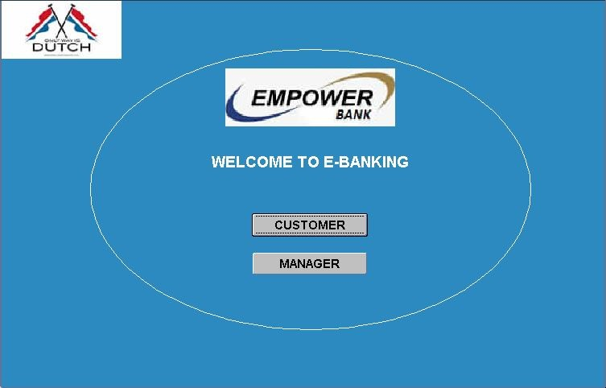

## ∞ CUSTOMER BUTTON

Trigger: When-button-pressed BEGIN CALL\_FORM('/data/appl/apps/apps\_st/appl/po/12.0.0/forms/US/ G1\_CUSTOMERHOMEPAGE'); END;

- ∞ MANAGER BUTTON

Trigger: When button pressed BEGIN CALL\_FORM(Ô/data/appl/apps/apps\_st/appl/po/12.0.0/forms/US/ G1\_MANAGERLOGINPAGE'); END;

## 2. MANAGER LOGIN

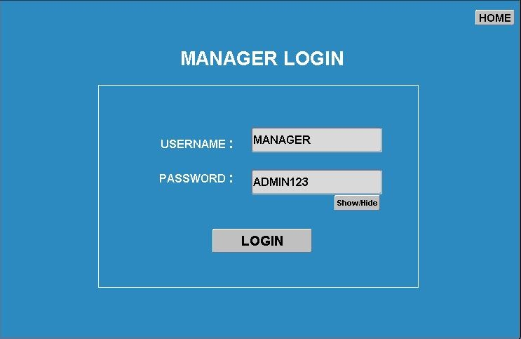

## ∞ SHOW/HIDE PASSWORD BUTTON

## Trigger:when-button-pressed

```
begin IF(GET_ITEM_PROPERTY('PASSWORD',CONCEAL_DATA)='TRUE') then SET_ITEM_PROPERTY('PASSWORD', CONCEAL_DATA, PROPERTY_false); else SET_ITEM_PROPERTY('PASSWORD', CONCEAL_DATA, PROPERTY_true); end if; end;
```

## ∞ LOGIN BUTTON

## Trigger:when button pressed

```
BEGIN IF :USERNAME='MANAGER' AND :PASSWORD='ADMIN123' THEN CALL_FORM('/data/appl/apps/apps_st/appl/po/12.0.0/forms/US/ G1_MANAGERAPPROVAL.fmx'); ELSE fnd_message.set_string ('INVALID CREDENTIALS');
```

fnd\_message.show; END IF; END;

## ∞ HOME BUTTON

Trigger:when button pressed

BEGIN CALL\_FORM('/data/appl/apps/apps\_st/appl/po/12.0.0/forms/US/ G1\_HOMEPAGE.fmx'); END;

## 3. MANAGER APPROVAL

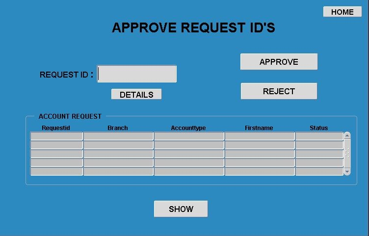

## ∞ APPROVE BUTTON

```
Trigger :when-button-pressed declare v G1_ACCOUNTREQUEST%rowtype; A VARCHAR2(5); B VARCHAR2(3); C VARCHAR2(2); K VARCHAR(15); begin IF :T1 IS NULL THEN FND_MESSAGE.SET_STRING('ENTER REQUEST ID'); FND_MESSAGE.SHOW; END IF; UPDATE  G1_ACCOUNTREQUEST SET STATUS='APPROVED' WHERE RequestId=:T1; select * into v from G1_ACCOUNTREQUEST where requestid=:t1; select lpad( max(substr(Account_Number,6,5)+1),5,0)  INTO A from G1_REGISTEREDINFO; select substr(FirstName,1,3) INTO B from  G1_ACCOUNTREQUEST WHERE RequestId=:T1; SELECT ACCOUNTTYPE INTO C FROM G1_ACCOUNTREQUEST WHERE RequestId=:T1; K:=C||B||A; insert into G1_REGISTEREDINFO values(:T1,K,v.branch,v.accounttype,v.title,v.firstname,v.lastname,V.DOB,v.workphone,v.ho mephone,v.address,v.state,v.zip,v.email,'N','0000'); standard.commit; FND_MESSAGE.SET_STRING(:T1||' REQUESTID IS APPROVED');
```

```
FND_MESSAGE.SHOW; end;
```

## ∞ SHOW BUTTON

## Trigger:when-button pressed

```
BEGIN GO_BLOCK('G1_ACCOUNTREQUEST_B2'); EXECUTE_QUERY; EXCEPTION WHEN NO_DATA_FOUND THEN FND_MESSAGE.SET_STRING('NO REQUEST ID TO BE APPROVED'); FND_MESSAGE.SHOW; END;
```

## ∞ HOME BUTTON

## Trigger:when-button-pressed

```
BEGIN CALL_FORM('/data/appl/apps/apps_st/appl/po/12.0.0/forms/US/ G1_HOMEPAGE.fmx'); END;
```

## ∞ DETAILS

## Trigger:when-button-pressed

```
declare pl_id7 paramlist; begin if :t1 is null then fnd_message.set_string('enter request id'); fnd_message.show; end if;
```

```
if not id_null(pl_id7) then destroy_parameter_list(pl_id7); else pl_id7:= create_parameter_list('pl_name3'); add_parameter(pl_id7,'p5',text_parameter,:t1); end if; call_form('/data/appl/apps/apps_st/appl/po/12.0.0/forms/us/ g1_customerdetail.fmx',no_hide,do_replace,no_query_only,pl_id7); end;
```

## ∞ REJECT

## Trigger:when-button-pressed

```
begin if :t1 is null then fnd_message.set_string('enter request id!'); fnd_message.show; else update  g1_accountrequest set status='rejected' where requestid=:t1; standard.commit; fnd_message.set_string(:t1||' request id is rejected'); fnd_message.show; end if; end;
```

## 4. CUSTOMER NEW ACCOUNT REGISTRATION

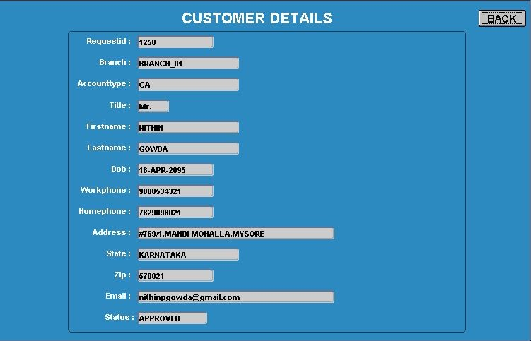

## ∞ WORK PHONE VALIDATION(EXACT 10 DIGITS)

## Trigger:When-validate-item

```
begin if  not length(:work_phone)=10 then fnd_message.set_string('ENTER VALID NUMBER'); fnd_message.show; :WORK_PHONE:=''; END IF; END;
```

- ∞ HOME PHONE VALIDATION(EXACT 10 DIGITS)

```
Trigger:When-validate-item
```

```
begin if  not length(:work_phone)=10 then
```

```
fnd_message.set_string('ENTER VALID NUMBER'); fnd_message.show; :work_phone:=''; end if; end;
```

## ∞ EMAIL FIELD VALIDATION

## Trigger:when-validate-item

```
declare email_input varchar(50); begin email_input:=:EMAIL; IF email_input is  null or  email_input not  like '%@%.com' then FND_message.SET_STRING('Please enter a valid email address!'); FND_message.SHOW; clear_message; :EMAIL:=null; end if; end;
```

## ∞ SUBMIT BUTTON

## Trigger:when-button-pressed

```
declare v G1_ACCOUNTREQUEST%rowtype; begin insert into G1_ACCOUNTREQUEST values(:requestid,:branch,:account_type,:title,:first_name,:last_name,to_date(:dob, 'dd-mon-yy'),:work_phone,:home_phone,:address,:state,:zip,:email,:status); standard.commit;
```

- ∞

```
select *  into v from G1_ACCOUNTREQUEST where requestid=:requestid; fnd_message.set_string('Submission Successful'); fnd_message.show; CALL_FORM('/data/appl/apps/apps_st/appl/po/12.0.0/forms/US/ G1_CUSTOMERHOMEPAGE'); exception when no_data_found then fnd_message.set_string('submission failed.Enter valid data'); fnd_message.show; end;
```

## HOME BUTTON

## Trigger:when button pressed

BEGIN CALL\_FORM('/data/appl/apps/apps\_st/appl/po/12.0.0/forms/US/ G1\_CUSTOMERHOMEPAGE'); END;

## 5. CHECK STATUS

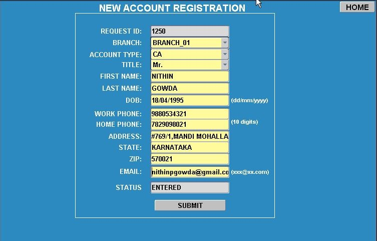

## ∞ CHECK BUTTON

## Trigger:When button pressed

```
declare v varchar2(20); a varchar2(20); begin select status into  v from G1_ACCOUNTREQUEST where requestid=:T1; if v='APPROVED' THEN SELECT Account_Number into a from G1_REGISTEREDINFO where requestid=:T1; fnd_message.set_string('your account is approved .please note down your account number'|| ' ' ||a); fnd_message.show; CLEAR_FORM; raise form_trigger_failure; elsif v='ENTERED' THEN fnd_message.set_string('your account is NOT YET approved');
```

```
fnd_message.show; elsif v='REJECTED' THEN fnd_message.set_string('your account is Rejected'); fnd_message.show; end if; exception when no_data_found then fnd_message.set_string('INVALID REQUEST ID'); fnd_message.show; raise form_trigger_failure; end;
```

## ∞ BACK BUTTON

## Trigger: when button pressed

BEGIN CALL\_FORM('/data/appl/apps/apps\_st/appl/po/12.0.0/forms/US/ G1\_CUSTOMERHOMEPAGE'); END;

## 6. ONLINE REGISTRATION

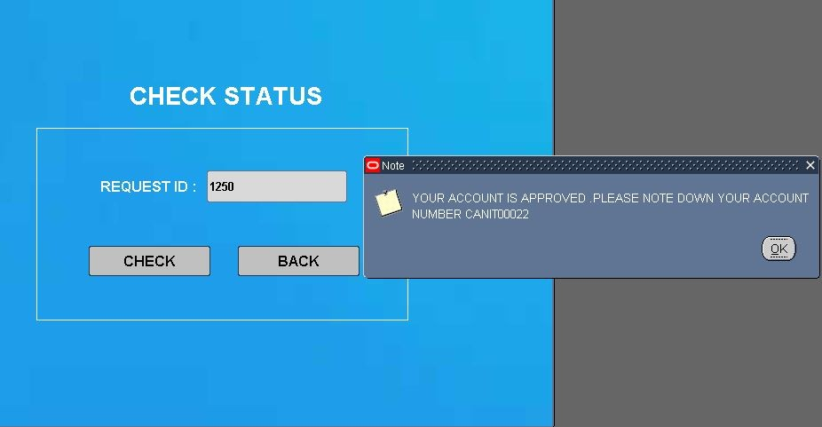

## ∞ ACCOUNT NUMBER FIELD

## Trigger:when-validate-item

```
declare temp varchar2(1); begin select  ONLINE_REGISTRATION  into temp from G1_REGISTEREDINFO where ACCOUNT_NUMBER= :T3; if temp is NULL then fnd_message.set_string('Invalid Account Number'); fnd_message.show; raise form_trigger_failure; end if; if temp='Y'then fnd_message.set_string('Account Already Registered'); fnd_message.show;
```

```
raise form_trigger_failure; end if; END;
```

## ∞ SUBMIT BUTTON

## Trigger:when-button-pressed

```
begin if not :t2=:t1 then fnd_message.set_string('password is not matching '); fnd_message.show; else update g1_registeredinfo set online_registration='y',password11=:t1 where account_number=:t3; standard.commit; end if; end;
```

## ∞ SHOW/HIDE BUTTON

Trigger:when-button-pressed begin

```
IF(GET_ITEM_PROPERTY('PASSWORD',CONCEAL_DATA)='TRUE') then SET_ITEM_PROPERTY('PASSWORD', CONCEAL_DATA, PROPERTY_false); else SET_ITEM_PROPERTY('PASSWORD', CONCEAL_DATA, PROPERTY_true); end if; end;
```

## ∞ PASSWORD FIELD VALIDATION

Trigger:when-validate-item begin

```
if(length(:T1)<6) then fnd_message.set_string('Password should be atleast 6 characters'); fnd_message.show; RAISE FORM_TRIGGER_FAILURE; end if; end;
```

## 7. CUSTOMER LOGIN

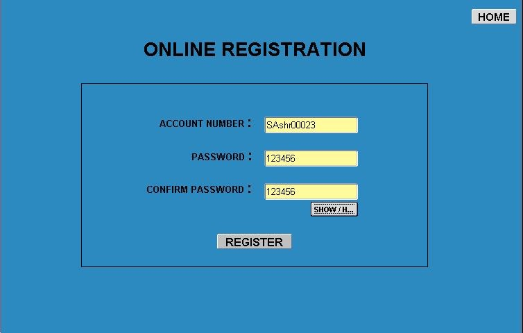

## ∞ SUBMIT BUTTON

## Trigger:when-button-pressed

```
declare a varchar2(20); pl_id paramlist; begin select password11 into a from g1_registeredinfo where account_number=:t1;
```

```
if not id_null(pl_id) then
```

```
destroy_parameter_list(pl_id); else pl_id := create_parameter_list('pl_name'); add_parameter(pl_id,'p1',text_parameter,:t1); end if; if :t2=a then call_form('/data/appl/apps/apps_st/appl/po/12.0.0/forms/us/ g1_transactionentry.fmx',no_hide,do_replace,no_query_only,pl_id); else fnd_message.set_string('invalid credentials'); fnd_message.show; end if; exception when no_data_found then fnd_message.set_string('invalid credentials'); fnd_message.show; end; ∞ HOME BUTTON Trigger:when-button-pressed begin call_form('/data/appl/apps/apps_st/appl/po/12.0.0/forms/us/ g1_customerhomepage'); end; ∞ SHOW HIDE BUTTON Trigger:when-button-pressed begin IF(GET_ITEM_PROPERTY('T2',CONCEAL_DATA)='TRUE') then
```

```
SET_ITEM_PROPERTY('T2', CONCEAL_DATA, PROPERTY_false); else SET_ITEM_PROPERTY('T2', CONCEAL_DATA, PROPERTY_true); end if; end;
```

## 8. TRANSACTION

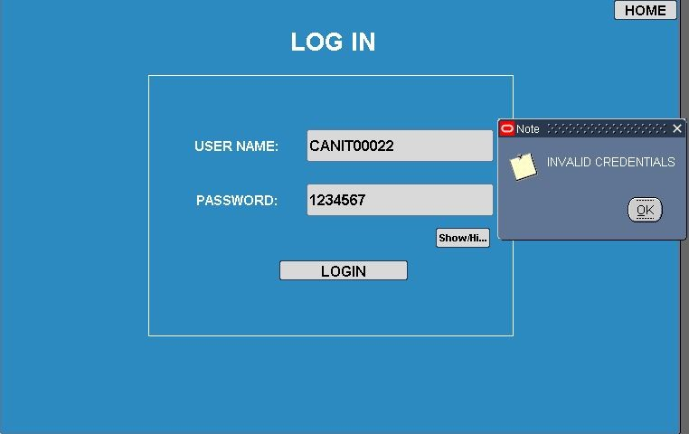

## ∞ TRANSACTION ENTRY (SUBMIT BUTTON)

```
Trigger: when-button-pressed begin if :T4 is null then fnd_message.set_string('ENTER VALID AMOUNT');
```

## ∞ VIEW TRANSACTION

```
fnd_message.show; ELSif :T5 is null then fnd_message.set_string('ENTER VALID CHEQUE NUMBER'); fnd_message.show; ELSif :T6 is null then fnd_message.set_string('ENTER VALID TRANSACTION TYPE'); fnd_message.show; ELSE INSERT INTO G1_TRANSACTIONINFO VALUES (:T1,:T3,:T2,:T4,:T5,:T6); STANDARD.COMMIT; fnd_message.set_string('TRANSACTION SUCCESSFULL'); fnd_message.show; END IF; end; Trigger: when-button-pressed declare pl_ACC paramlist; BEGIN IF NOT ID_NULL(pl_ACC) THEN destroy_parameter_list(pl_ACC); ELSE pl_ACC := create_parameter_list('pl_AFF'); add_parameter(pl_ACC,'P1',text_parameter,:T2); END IF; CALL_FORM('/data/appl/apps/apps_st/appl/po/12.0.0/forms/US/ G1_TRANSACTIONDETAILS',NO_HIDE,DO_REPLACE,NO_QUERY_ONLY ,pl_ACC); END;
```

## ∞ AMOUNT VALIDATION

```
Trigger: When-validate-item BEGIN IF :T4<1 THEN fnd_message.set_string('AMOUNT SHOULD BE GREATER THAN 0'); fnd_message.show; ELSIF LENGTH(:T4)>7 THEN fnd_message.set_string('TRANSACTION LIMIT IS 10 LAKHS'); fnd_message.show; END IF; END;
```

## ∞ CHEQUE NO. VALIDATION

```
Trigger: When-validate-item BEGIN IF NOT  LENGTH(:T5)=6 THEN fnd_message.set_string('INVALID CHEQUE NUMBER'); fnd_message.show; END IF; END;
```

## 9. TRANSACTION DETAILS

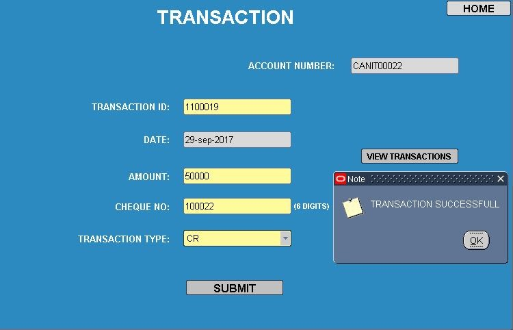

## ∞ CHECK BUTTON

## Trigger: When Button Pressed

BEGIN

IF :T1 IS NULL OR :T2 IS NULL THEN

fnd\_message.set\_string('ENTER VALID DATE');

fnd\_message.show;

ELSE

GO\_BLOCK('G1\_TRANSACTIONINFO');

EXECUTE\_QUERY;

END IF;

EXCEPTION

WHEN NO\_DATA\_FOUND THEN

fnd\_message.set\_string('NO ENTRY FOUND');

fnd\_message.show;

END;

## ∞ BACK BUTTON

```
Trigger: when button pressed declare pl_ACC paramlist; BEGIN IF NOT ID_NULL(pl_ACC) THEN destroy_parameter_list(pl_ACC); ELSE pl_ACC := create_parameter_list('pl_AFFF'); add_parameter(pl_ACC,'P1',text_parameter,:T3); END IF; CALL_FORM('/data/appl/apps/apps_st/appl/po/12.0.0/forms/US/ G1_TRANSACTIONENTRY',NO_HIDE,DO_REPLACE,NO_QUERY_ONLY,p l_ACC); END;
```

## ∞ DATE VALIDATION

```
Trigger: when-validate-item begin if :t2>sysdate OR :t2<:t1 then fnd_message.set_string('PLEASE ENTER VALID DATE '); fnd_message.show; :T1:=''; :T2:=''; END IF; END;
```

## 10. INTEREST CALCULATOR

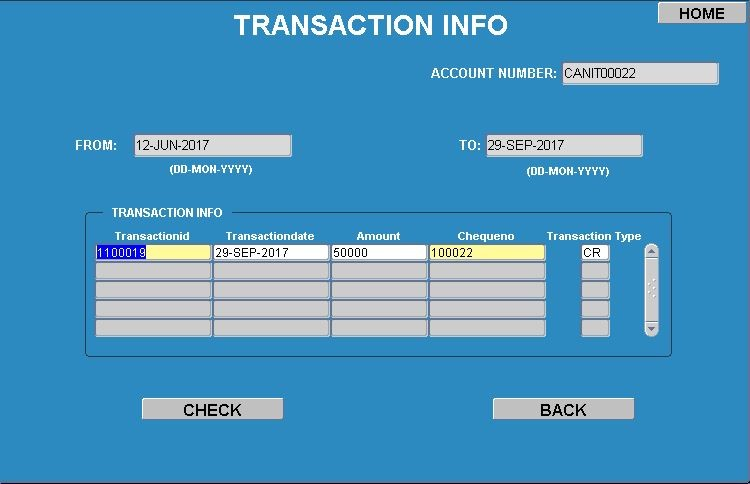

- ∞ LOAN

## Trigger:when-list-changed

BEGIN

IF :T5='HOME LOAN' THEN

:T3:=8;

ELSIF :T5='EDUCATION LOAN' THEN

:T3:=6;

ELSIF :T5='AGRICULTURE LOAN' THEN

:T3:=6;

ELSIF :T5='TWO WHEELER LOAN' THEN

:T3:=11;

ELSIF :T5='FOUR WHEELER LOAN' THEN

:T3:=12;

ELSIF :T5='GOLD LOAN' THEN

:T3:=10;

ELSIF :T5='PERSONAL LOAN' THEN

:T3:=11;

END IF;

END;

## ∞ PRINCIPLE AMOUNT

## Trigger:when-validate-item

```
begin if :t5='home loan' then if not :t1 between 100000 and 100000000 then fnd_message.set_string('loan amount eligibility is 1 lakh to 10 crores'); fnd_message.show; raise form_trigger_failure; end if; elsif :t5='education loan' then if not :t1 between 25000 and 2500000 then fnd_message.set_string('loan amount eligibility is 25 thousands to 25 lakhs'); fnd_message.show; raise form_trigger_failure; end if; elsif :t5='agriculture loan' then if not :t1 between 20000 and 3000000 then fnd_message.set_string('loan amount eligibility is 20 thousands to 30 lakhs '); fnd_message.show; raise form_trigger_failure; end if; elsif :t5='two wheeler loan' then
```

```
if not :t1 between 20000 and 300000 then fnd_message.set_string('loan amount eligibility is 20 thousands to 3 lakhs'); fnd_message.show; raise form_trigger_failure; end if; elsif :t5='four wheeler loan' then if not :t1 between 100000 and 3000000 then fnd_message.set_string('loan amount eligibility is 1 lakh to 30 lakhs'); fnd_message.show; raise form_trigger_failure; end if; elsif :t5='gold loan' then if not :t1 between 50000 and 2500000 then fnd_message.set_string('loan amount eligibility is 50 thousands to 25 lakhs'); fnd_message.show; raise form_trigger_failure; end if; elsif :t5='personal loan' then if not :t1 between 1000000 and 2000000 then fnd_message.set_string('loan amount eligibility is 1 lakh to 20 lakhs'); fnd_message.show; raise form_trigger_failure; end if; end if; end;
```

## ∞ CALCULATE

Trigger:when-button-pressed begin

```
if :T1 is NULL OR :T2 is NULL OR :T3 is NULL then fnd_message.set_string('Enter all values'); fnd_message.show; end if; :T4 := (:T1* :T2 * :T3) / 100; end;
```

## ∞ CLEAR

## Trigger: when-button-pressed

```
begin clear_form; end;
```

## ENHANCEMENTS

1. In case of an unsuccessful registration process, in the New Account Registration page, the Request ID generated for that customer is rendered invalid and is retained for the next registration made.
2. Show/ Hide Password functionality has been implemented in the manager and customer login page.
3. In the Request ID approval page, the Manager is able to check the Customer details, corresponding to the Request ID, as and when required.
4. The Request ID approval page allows the manager to view all the Request IDs that have not yet been approved, i.e. those with status as 'Entered'. The Manager can take further action (Approve/ Reject) by entering that Request ID in the field given.
5. The Request ID page provides the Reject Button whereby the Manager can reject the request of a customer, in case the Customer is ineligible to open an account with the bank. The Manager holds the right for approval and rejection of a request.
6. The Online Registration page consists of the following validations:
- a) The minimum length of the password created should be 6.
- b) Password confirmation functionality has been implemented whereby an alert is shown in case the password re-typed does not match with the given password.
6. The Transaction page includes the following validations:
- a) Amount entered cannot be zero or negative. The transaction limit has been set to 10 lakhs.
- b) The Cheque number entered should have exactly 6 digits.
7. The Transaction Info Page consists of the following validations:
- A) The 'To' Date field cannot take a date value occuring after the current date.
- B) Also, the 'From' date value should have a date value occuring before the 'To' Date only.
8. The Interest Calculator allows the User to choose a type of loan for which interest has to be calculated. Accordingly, the interest rate and the interest calculated are displayed. Also, the

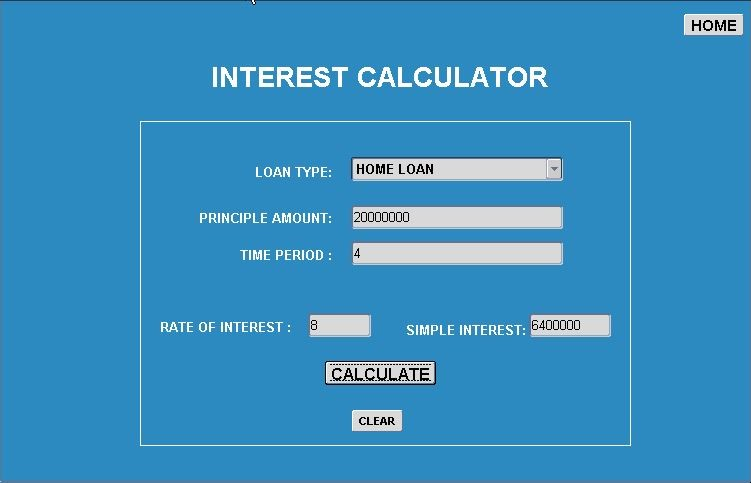

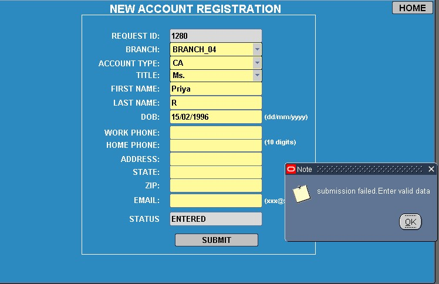

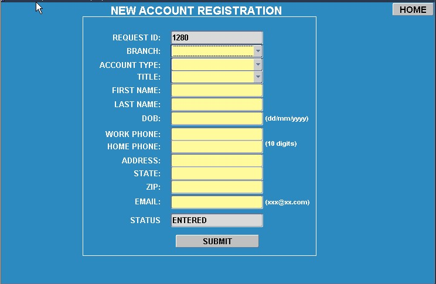

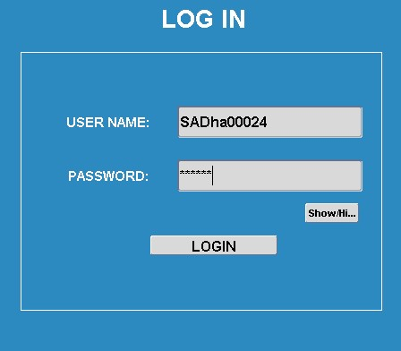

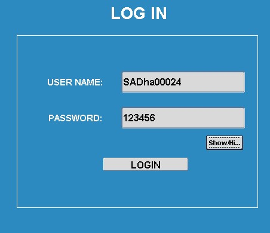

Amount specified by the User should lie in the eligibility range (decided by the Bank). If not, an alert message is displayed specifying the amount eligibility range for the type of loan selected.